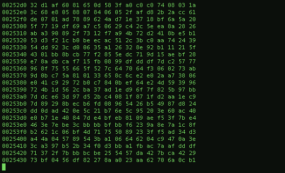

<h1 align="center">
  <b>Hi there 👋, I am Ramin</b>
</h1>

<dev>
  

    Heya! I'm Ramin , a stdudent who is
    studying Computer Engineering, currently 4th grade.
    Possess strong communication skills and keen to
    pursue a career in Cyber-Security and Network
    Programming fields. I have been dealing with cyber
    security in the last 3 years and I have tried to imporve
    myself as much as possible in this field, always thirsty to learn more.
    I am an active member of free online platforms for
    learning cyber security, that use hands-on exercises
    and labs for instance, <a href="https://tryhackme.com/xramx"> "tryhackme.com" </a>and
    "hackthebox.eu". There is a lot to learn
    and as I said before I am always open to learning
    more.
  

  
  
</dev>

  

<!-- 

  

 -->

## My Statistics

 

  

 

- 🔭 I’m currently working on ...
- 🌱 I’m currently learning ...
- 👯 I’m looking to collaborate on ...
- 🤔 I’m looking for help with ...
- 💬 Ask me about ...
- 📫 How to reach me: ...
- 😄 Pronouns: ...
- ⚡ Fun fact: ...
-->
